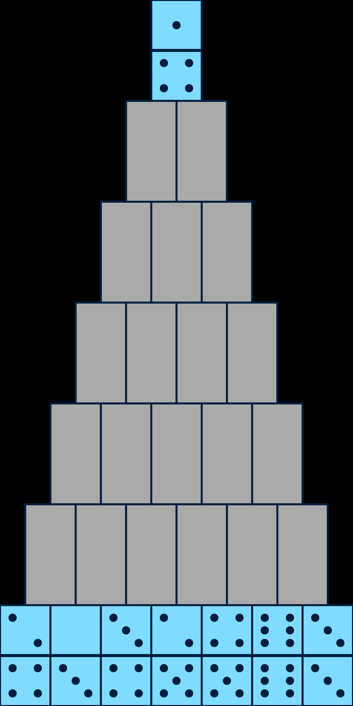

# Domino Pyramid
A simple single-player domino game built with [ruby2d](https://github.com/ruby2d/ruby2d) gem.

**[Play it in your browser](https://enjaku4.github.io/domino_pyramid/)**

To launch the game install the `ruby2d` gem, then run `ruby main.rb`.

## Rules
The 28 tiles of a double-six domino set — *bones* — are laid out in a seven-row pyramid, face down, except for the top and bottom rows, which start face up.

Select a face-up bone, then a second one. If their pips add up to 12, both bones are removed; otherwise both are deselected. Selecting an already selected bone deselects it.

Removing a pair can turn other bones face up: a bone is revealed once nothing overlaps it in the row above, or nothing overlaps it in the row below.

You win by clearing the entire pyramid. If no two face-up bones add up to 12, you lose.

## Native app
Run `rake build` to compile a standalone executable.

